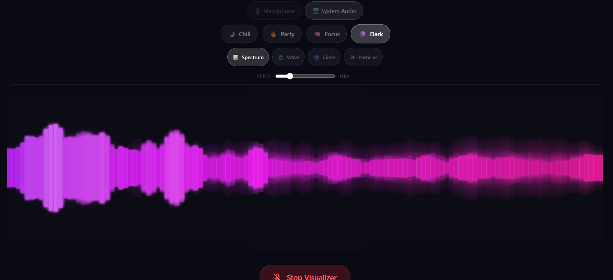

# Vocali

A voice-controlled audio platform with real-time transcription, Spotify integration, and multilingual voice commands. Built with React 19 and a FastAPI backend.

## Features

- **Real-time recording** with live transcription via Speechmatics WebSocket API
- **Spotify integration** — search, play, and browse tracks with infinite scroll
- **Favorites** — save and manage favorite Spotify tracks
- **Voice commands** — control playback, recording, favorites, and AI playlist generation hands-free (EN/RU/UK)
- **Vocali Studio** — real-time audio visualizer with multiple modes, moods, and audio sources
- **Audio file management** — upload, playback with waveform visualization, download transcriptions
- **Auth** — login, register, password reset with JWT tokens

## Tech Stack

| Layer | Tech |
|-------|------|
| Frontend | React 19, TypeScript, Vite |
| Styling | Tailwind CSS v4 |
| State | Redux Toolkit |
| Transcription | Speechmatics real-time API (WebSocket) |
| Music | Spotify API (via FastAPI backend) |
| Audio | WaveSurfer.js, Web Audio API |
| Backend | FastAPI (separate repo) |

## Vocali Studio

A built-in audio visualizer at `/studio` that reacts to live audio in real time.



### Audio Sources

- **Microphone** — captures sound via mic input (e.g. music playing through speakers)
- **System Audio** — captures audio directly from a browser tab using the `getDisplayMedia` API (user selects a tab and checks "Share tab audio" in the browser dialog)

### Moods

Select a mood to change the color palette and default visualization mode:

| Mood | Default Mode | Color Palette |
|------|-------------|---------------|
| 🌙 Chill | Wave | Blue tones |
| 🔥 Party | Particles | Red/orange tones |
| 🧠 Focus | Spectrum | Green tones |
| 🌑 Dark | Circle | Purple tones |

### Visualization Modes

| Mode | Description |
|------|-------------|
| 📊 Spectrum | Frequency bars mirrored around the center |
| 🌊 Wave | Oscilloscope-style waveform |
| 🔵 Circle | Radial frequency bars around a pulsing ring |
| ✨ Particles | Particles that explode from the center on bass hits |

### Sensitivity Slider

Adjust how strongly the visualizer reacts to audio (0.2x – 3.0x) in real time.

## Insights

A dedicated dashboard at `/insights` that visualizes music trends and artist data using the **Last.fm API**.

### Features

- **Top Artists & Tracks** — view globally popular artists and top tracks.
- **Interactive Charts** — features a Top Artists bar chart and a Genre donut chart for a visual breakdown of musical tags.
- **Artist Search & Details** — search for any artist or click on an artist from the chart to dynamically view their specific top tags and statistics.
- **Modern UI** — styled with a glassmorphism design and neon accents, fully supporting both dark and light themes.

## Voice Commands

Voice control supports **English**, **Russian**, and **Ukrainian**. Toggle the microphone icon in the header to activate.

| Action | EN | RU | UK |
|--------|----|----|-----|
| Play track | `play / start / launch / open / put on / turn on / search for / find / i want to hear / play me <query>` | `играй / включи / поставь / запусти / воспроизведи <query>` | `грай / увімкни / постав / запусти / відтвори <query>` |
| Pause | `pause / stop / halt / freeze / mute / quiet / silence / be quiet` | `пауза / стоп / остановить / тишина` | `пауза / стоп / зупини` |
| Next track | `next / skip / forward / next one / another one / change song / change track` | `следующий / дальше / далее / вперёд / пропусти` | `наступний / далі / вперед / пропусти` |
| Previous | `previous / back / rewind / prev / last one / that one again` | `предыдущий / назад / вернись` | `попередній / назад / поверни` |
| Favorite | `favorite / like / save / bookmark` | `в избранное / лайк / сохранить / запомни` | `до улюблених / лайк / зберегти` |
| Unfavorite | `remove from favorites / remove from favourites / remove favorite / remove favourite / delete from favorites / delete from favourites / delete favorite / delete favourite / unfavorite / unlike / unheart / remove bookmark / unsave` | `удалить из избранного / убрать из избранного / удали из избранного / убери из избранного / не нравится / разлюбить` | `видалити з улюблених / прибрати з улюблених / видали з улюблених / не подобається` |
| Record | `start recording / stop recording / record` | `начать запись / остановить запись / записать` | `почати запис / зупинити запис / записати` |
| Create playlist | `create / make / generate / build playlist` | `создай / сделай / сгенерируй плейлист` | `зроби / створи / згенеруй плейлист` |

### AI Playlist Generation

Voice commands can generate full playlists via AI. Say something like:

- "create jazz playlist for 30 minutes"
- "create chill playlist music for 2 hours"

The command is captured via the Web Speech API and matched by `PLAYLIST_REGEX` in `useVoiceCommands.ts`. The prompt is sent to `POST /ai/playlist` on the backend, which uses OpenRouter AI (`openai/gpt-oss-120b`) to parse the intent — extracting genre, BPM hint, duration, and number of tracks needed. Real tracks are then fetched from Spotify via `GET /spotify/search`. The resulting queue is displayed in the SpotifyPanel under the label **"AI Playlist · N tracks"**.

## Setup

```bash
git clone <repository-url>
cd vocali-interface
pnpm install
```

### Environment Variables

Create a `.env` file based on `.env.example`:

```
VITE_API_BASE_URL=http://localhost:8000/api
VITE_SPEECHMATICS_API_KEY=your_speechmatics_api_key
```

- `VITE_API_BASE_URL` — FastAPI backend URL (handles auth, audio uploads, Spotify proxy)
- `VITE_SPEECHMATICS_API_KEY` — API key from [Speechmatics](https://www.speechmatics.com/) for real-time transcription

### Run

```bash
pnpm run dev
```

The app runs at `http://localhost:3000`.

## Scripts

- `pnpm run dev` — development server
- `pnpm run build` — production build
- `pnpm run preview` — preview production build
- `pnpm run lint` — ESLint

## Project Structure

```
src/
  components/     UI components (SpotifyPanel, FavoritesPanel, RealTimeRecording, studio/, etc.)
  constants/      Voice commands, studio config
  hooks/          useSpotify, useVoiceCommands, useAudioFiles, useAudioAnalyzer, useVisualizer
  pages/          Main, Auth, Login, Register, Studio
  redux/          Store and auth slice
  services/       API client, Spotify service
  types/          TypeScript interfaces
```
